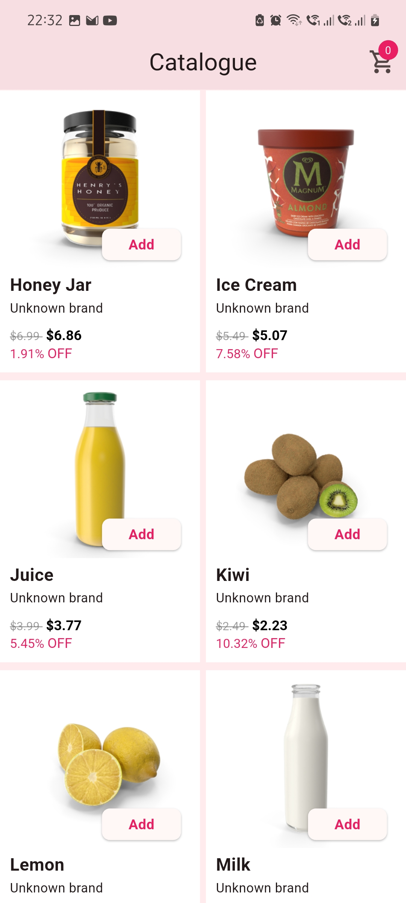
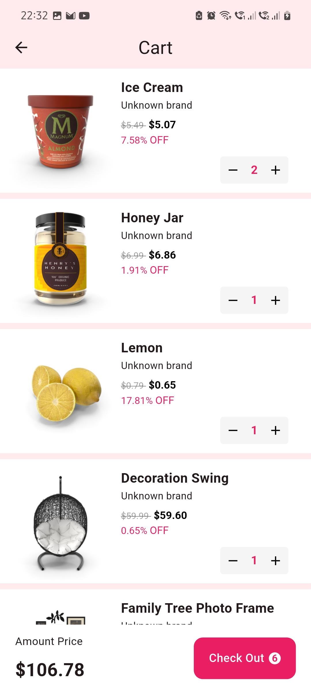

# Shopping App

A Flutter based shopping app that provides a catalogue of products, a cart system, and a product detail page. The app supports features like image sliders, dynamic product loading with pagination, and seamless user experience.

## Features

- **Catalogue Page**: Displays a list of products, with infinite scroll and shimmer effects for loading states.
- **Product Detail Page**: Displays detailed information about a product, including images, price, rating, and description.
- **Cart System**: Allows users to add products to the cart and view the total price.
- **Image Slider**: A carousel slider to view product images with smooth transitions.
- **State Management**: Riverpod is used for efficient state management.
- **Shimmer Effect**: Placeholder shimmer effect during data loading.
- **Error Handling**: Displays shimmer if there's an issue with the network.

## Screenshots

&nbsp;&nbsp;&nbsp;
&nbsp;&nbsp;&nbsp;
&nbsp;&nbsp;&nbsp;
